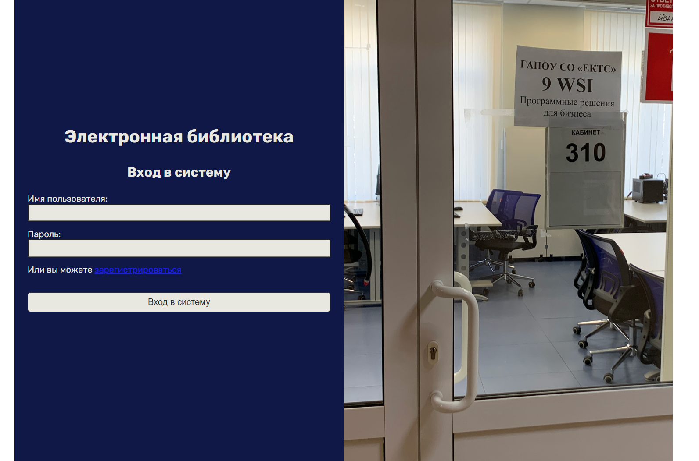

# Элеткронная библиотека

Разработает веб-приложение "электронная библиотека". Предполагается следующая функциональность:
- пользователи библиотеки - это клиенты и администраторы;
- доступ к содержимому библиотеки открыт только для зарегистрированых пользователей;
- пользователь может зарегистритьваться;
- пользователь может выполнить вход в систему;
- в каталоге книг можно скачать книгу или перейти к подробной информации;
- можно использовать поиск по каталогу;
- можно выбрать категорию книг;
- в режиме администратора также доступны действия по добавлению, изменению и удалению книги;
- пользователь имеет личный кабинет, где может изменить информацию о себе (в текущей версии не реализовано).

Макет [Figma](https://www.figma.com/file/MPyxIOrncu53T7Z9P0hLbg/Untitled?type=design&node-id=6%3A95&mode=design&t=zOxfxzz01yQMt3to-1) для разрабатываемой системы.
*В процессе разработки задания макет может немного изменяться и дополняться*.
*Мы будем следовать макету не совсем точно (хотя и достаточно близко).*

## 1. Начальная конфигурация проекта

### 1.1 Изменение Program.cs

Создадим пустой проект Asp.Net Core и добавим вручную в него шаблон MVC.

В созданном проекте внедрим зависимость:
```cs
builder.Services.AddControllersWithViews();
```

и добавим в конвейер необходимые middleware:
```cs
var app = builder.Build();
app.UseStaticFiles();
app.UseRouting();
app.MapControllerRoute("default", "{Controller=Home}/{Action=Index}");
app.Run();
```

`UseStaticFiles` - для обработки статических файлов в каталоге `wwwroot`,
`UseRouting` - для подключения маршрутизации,
`MapControllerRoute` - для указания маршрута, по которому нужно выбирать контроллер и его метод (действие).

### 1.2 Добавление контроллера для списка книг

Добавим контроллер для списка книг. Сперва создадим папку `Controllers`. Далее, через контекстное меню (ПКМ по папке `Controllers`) выберем пункт для добавления контроллера:


Добавим пустой контроллер

и дадим ему имя `BooksController`


Добавим представление. Для этого, можно либо создать вручную каталог `Views` и в нем добавить каталог `Books`, где уже выполнить создание представления. Либо же можно нажать ПКМ по методу `Index` и выбрать пункт меню добавить представление.
**Первый способ (создаем каталоги вручную):**


**Второй способ (создает каталоги автоматически):**


Вне зависимости от способа даем имя представлению `Index`:


В коде разметки зададим:
```xml
<h1>Каталог книг</h1>
```

Запустим и проверим работоспособность, указав в браузере путь `/books/index`.

После успешного запуска измените в файле `Program.cs` шаблон, чтобы автоматически обрабатывать контроллер `Books` и действие `Index`:
```cs
app.MapControllerRoute("default", "{Controller=Books}/{Action=Index}");
```

## 1.3 Добавление Tag Helpers

Для дальнейшей работы нам понадобятся **Tag Helpers**. Подключим их для наших представлений. Для этого можно нажать ПКМ на папку с представлениями (на `Views`) и выбрать пункт `"Добавить" -> "Создать элемент"`. В окне создания выбрать категорию `Asp.Net Core->веб`, найти пункт "Импорт представлений Razor" (имя файла будет `_ViewImports`).


В файле мы пропишем:
```cs
@using ELibraryDemo
@addTagHelper *, Microsoft.AspNetCore.Mvc.TagHelpers
```

Первая строчка импортирует для всех представлений пространство имен `ELibraryDemo`.
Вторая строчка добавляет Tag helpers, что позволит в дальнейшем использовать специальные теги и аттрибуты, которые упростят создание разметки (особенно полезно для создания форм).

## 1.4 Добавление View Start

По аналогии с предыдущим пунктом добавьте "Запуск представлений Razor" (имя файла будет `_ViewStart`):


Вид обозревателя решений:


В файле будет следующий текст:
```xml
@{
    Layout = "_Layout";
}
```

Код данного файла будет выполнен при запуске любого представления. Сам смысл кода - установить в качестве макета представление `_Layout`. Сам макет мы создадим далее.

## 1.5 Добавление Layout

Добавим в проект общий макет для представлений. Для этого сперва создадим в папке `Views` папку c названием `Shared`. Представления, частичные представления и макеты в данной папке будут доступны для всех контроллеров. Чтобы создать макет, в папке `Shared` добавьте файл "Макет Razor" (имя файла будет `_Layout.cshtml`)


Вид обозревателя решений:


Код `_Layout`, созданный по умолчанию:
```xml
<!DOCTYPE html>

<html>
<head>
    <meta name="viewport" content="width=device-width" />
    <title>@ViewBag.Title</title>
</head>
<body>
    <div>
        @RenderBody()
    </div>
</body>
</html>
```

Важным является вызов метода `RenderBody`, который отрисовывает содержимое представления. Остальной же код представляет собой обычный Html.

## 1.6 Добавление статических файлов

Для верстки нам могут понадобиться статические файлы: изображения, стили, скрипты, шрифты и т. д.
Мы уже подключили их обработку в конвейере:
```cs
app.UseStaticFiles();
```

Теперь же нужно создать в проекте папку `wwwroot`. Внутри папки создадим папку `styles`, где сразу добавим стиль `main.css` (можно создать через "Добавить"->"Создать элемент"). Вид обозревателя решений:


Также добавим стиль в файле разметки `_Layout`:
```xml
<link rel="stylesheet" href="~/styles/main.css" />
```

## 1.7 Разметка макета

### 1.7.1 Начальная разметка документа

Реализуем начальную разметку документа. В папке `wwwroot` создадим папку `images`, куда добавим файл `banner.png`.

Напишем начальную разметку:
```xml
<body>
    <!--ШАПКА-->
    <header>
        <nav>
            <div class="brand"></div>
            <div class="links"></div>
        </nav>
    </header>
    <!--ОСНОВНАЯ ЧАСТЬ-->
    <main>
        <div class="content">
            @RenderBody()
        </div>
    </main>
    <!--ПОДВАЛ-->
    <footer>

    </footer>
</body>
```

Заполним ее содержимым.
Бренд (обычно включает название и логотип):
```xml
<div class="brand">
    <a asp-controller="main" asp-action="index">
        <h1>Электронная библиотека</h1>
    </a>
</div>
```
Ссылки на другие страницы:
```xml
<div class="links">
    <ul>
        <li><a href="#">Личный кабинет</a></li>
        <li><a href="#">Выход</a></li>
    </ul>
</div>
```

Подвал:
```xml
<footer>
    <p>Разработано <a href="http://ects.ru">ects</a> в 2023 году</p>
</footer>
```

Запустите и проверьте работоспособность. Примерный вид:


### 1.7.2 Компоновка элементов

Начнем писать стили. Для компоновки элементов используем технологию flexbox.
https://developer.mozilla.org/ru/docs/Learn/CSS/CSS_layout/Flexbox
https://css-tricks.com/snippets/css/a-guide-to-flexbox/
https://www.youtube.com/watch?v=O-ytfplFQ3c&list=PLNkWIWHIRwMG0EUBS8rvTRVNL9IcxcawW


Первым делом сбросим значения `margin` и `padding` для всех элементов в `0`:
```css
* {
    margin: 0;
    padding: 0;
}
```

Это часто производят потому, что разные браузеры могут иметь различные значения отступов и полей для ряда элементов по умолчанию. Идея следующая: сбросить все в 0, а потом при необходимости переопределить для конкретных элементов, чтобы внешний вид был во всех бразерах одинаковым.

Зададим размещение основных элементов:
```css
body {
    display: flex;
    flex-direction: column;
    height: 100vh;
}

header {
    height: 330px;
    background-image: url('/images/banner.png');
    background-size: cover;
    background-repeat: no-repeat;
}

main {
    flex-grow: 1;
}

footer {
    height: 2em;
}
```

Для `body` мы устанавливаем `display: flex`, чтобы `body` был flex-контейнером. С помощью свойства `flex-direction: column` мы задаем направление элементов (основной оси) по вертикали. Высоту задаем во весь экран с помощью `height: 100vh`.

Информация про относительные единицы измерения:
https://html5book.ru/edinicy-izmereniya-vh-vw-vmin-vmax/

Далее, мы задаем высоту header и устанавливаем для него фоновое изображение с соответствующими настройками.

Для `footer` мы задаем высоту в `2em`.

Для контейнера `main` мы задаем `flex-grow: 1`, что заставит его занять все нераспределенное пространство.

Запустите, и проверьте работоспособность.

Полученный результат:


Немного изменим разметку, добавив один тег `div` в качестве обертки:
```xml
<body>
    <div class="wrapper-center">
        <!--ШАПКА-->
        <header>
            <nav>
                <div class="brand">
                    <a asp-controller="main" asp-action="index">
                        <h1>Электронная библиотека</h1>
                    </a>
                </div>
                <div class="links">
                    <ul>
                        <li><a href="#">Личный кабинет</a></li>
                        <li><a href="#">Выход</a></li>
                    </ul>
                </div>
            </nav>
        </header>
        <!--ОСНОВНАЯ ЧАСТЬ-->
        <main>
            <div class="content">
                @RenderBody()
            </div>
        </main>
        <!--ПОДВАЛ-->
        <footer>
            <p>Разработано <a href="http://ects.ru">ects</a> в 2023 году</p>
        </footer>
    </div>
</body>
```

Стиль, заданный ранее для `body` напишем для нашего элемента, блок для `body` оставим пустым:
```css
body {

}

.wrapper-center {
    display: flex;
    flex-direction: column;
    height: 100vh;
}
```
Визуально, при запуске приложения ничего не должно измениться. Проверьте, что это так.

Выравняем элемент `wrapper-center` по центру и зададим ему максимальную ширину:
```css
body {
    display: flex;
    justify-content: center;
}

.wrapper-center {
	flex-grow: 1;
    max-width: 1200px;
    display: flex;
    flex-direction: column;
    height: 100vh;
}
```

Для `body` мы поставили `display: flex`, направление основной оси (ориентация элементов) по умолчанию будет горизонтальным. Свойство `justify-content` позволяет выравнять контент вдоль основной оси, что заставит элементы выравняться по центру. `body` имеет лишь один дочерний элемент `.wrapper-center`, который встанет по центру. Мы заставляем этот элемент занять все свободном место с помощью `flex-grow: 1` и устанавливаем ограничение на максимальный размер в 1200 пикселей (`max-width`).

Добавим цвет фона с помощью `background-color`:
```css
.wrapper-center {
    max-width: 1200px;
    flex-grow: 1;
    display: flex;
    flex-direction: column;
    height: 100vh;
    background-color: #E9E8E0;
}
```

Полученный результат:


### 1.7.3 Навигационное меню

Реализуем навигационное меню. Сперва изменим стиль списка:
```css
.links ul {
    list-style-type: none;
    display: flex;
}

.links li {
    flex-grow: 1;
}
```

`list-style-type: none;` задаем, чтобы удалить у списка маркеры.

За счет `flex-grow: 1` все элементы списка займут одинаковое пространство. Запустите и проверьте содержимое страницы с помощью инструментов разработчика (F12).


Зададим стиль для навигационной панели:
```css
header nav {
    display: flex;
    justify-content: space-between;
    background: #E9E8E0;
}
```

`justify-content: space-between` позволит расположить элементы (`brand` и `links`) по краям, заполнив пространство между ними пустотой.


Добавим отступы и поля, сделаем закругление рамки, выровняем элементы по вертикали (дополнительной оси) с помощью `align-items`:
```css
header nav {
    display: flex;
    justify-content: space-between;
    background: #E9E8E0;
    height: 3em;
    margin: 1em 2em;
    align-items: center;
    border-radius: 5px;
    padding-left: 2em;
}
```
Для пунктов меню навигации добавим небольшие отступы:
```css
.links li {
    flex-grow: 1;
    margin-right: 2em;
}
```

Полученный результат:


### 1.7.4 Стиль ссылок

Изменим стиль ссылок навигационного меню, используя соответствующие псевдоклассы. Сперва удалим подчеркивание:
```css
nav a:link {
    text-decoration: none;
    color: #242C35;
}

nav a:visited {
    text-decoration: none;
    color: #242C35;
}
```

Затем зададим стиль по наведению на ссылку:
```css
.links a:hover {
    color: #D2AB99;
}
```

Проверьте работоспособность.

### 1.7.5 Шрифты

Добавим в проект шрифты.

Перейдем на сайт Google Fonts. Найдем необходимый шрифт (Rubik):


Выберем начертания Light (+ Light Italic), Regular (+ Regular Italic) и Bold. Для этого нужно нажать на кнопку +:


Справа появится меню, где можно увидеть добавленные шрифты и способы добавления их на сайт. Также, шрифты можно скачать (чтобы, например, разместить их у себя локально или расположить в отдельной папке в wwwroot). Выберем `@import`:


Код из `<style>` разместим в файле `main.css`:
```css
  @import url('https://fonts.googleapis.com/css2?family=Rubik:ital,wght@0,300;0,400;0,700;1,300;1,400&display=swap');
```

И зададим `font-family`:
```css
body {
    display: flex;
    justify-content: center;
    font-family: 'Rubik', sans-serif;
}
```

Для заголовка внутри `brand` зададим начертание `light`:
```css
.brand h1 {
    font-weight: 300;
}
```

Полученный результат:


## 2 Защита методов

### 2.1 Настройка в Program.cs

Выполним добавление аутентификации на основе Cookies. Добавим сервис и выполним настройку Cookies:
```cs
builder.Services
    .AddAuthentication(CookieAuthenticationDefaults.AuthenticationScheme)
    .AddCookie(opt =>
    {
        opt.ExpireTimeSpan = TimeSpan.FromHours(1);
        opt.Cookie.Name = "library_session";
        opt.Cookie.HttpOnly = true;
        opt.Cookie.SameSite = SameSiteMode.Strict;
        opt.LoginPath = "/User/Login";
    });
```

Добавим middleware:
```cs
var app = builder.Build();
app.UseStaticFiles();
app.UseRouting();
app.UseAuthentication();
app.UseAuthorization();
app.MapControllerRoute("default", "{Controller=Books}/{Action=Index}");
app.Run();
```

Добавим `[Authorize]` на метод контроллера `Books/Index`:
```cs
[Authorize]
public IActionResult Index()
{
    return View();
}
```

Если все сделано правильно, то при запуске программы нас перенаправит на адрес `/User/Login`, так как мы не являемся аутентифицированным пользователем.

### 2.2 Создание контроллера для работы с пользователями

Добавим контроллер `UserController`. В нем определим метод `Login`:
```cs
public class UserController : Controller
{
    public IActionResult Login()
    {
        return View();
    }
}
```

Также создадим представление (`Views/User/Login.cshtml`):

```xml
<h1>Вход в систему</h1>
```

Результат:


Все работает, однако что, если мы хотим отключить для определенного представления макет?
В этом случае, мы можем просто добавить строки кода, которые зададут свойство `Layout` в null (или другое значение, если мы хотим использовать несколько макетов):
```xml
@{
    Layout = null;
}

<h1>Вход в систему</h1>
```

Полученный результат:


Определим отдельный дизайн для страниц входа и регистрации.

### 2.3 Верстка страницы входа

Создадим первоначальный макет страницы:
```xml
<html>
<head>
    <meta name="viewport" content="width=device-width" />
    <title>@ViewBag.Title</title>
</head>
<body>
    <div class="content">
        <form>
            <h1>Электронная библиотека</h1>
            <h2>Вход в систему</h2>
            <label for="username">Имя пользователя:</label>
            <input type="text" name="username" />
            <label for="password">Пароль:</label>
            <input type="password" name="password" />
            <p>Или вы можете <a href="#">зарегистрироваться</a></p>
            <input type="submit" value="Вход в систему" />
        </form>
    </div>
    <div class="side-image">

    </div>
</body>
</html>
```

Получим следующий результат:


Создадим и добавим новый файл стилей `login.css`:
```xml
<link rel="stylesheet" href="~/styles/login.css" />
```

Добавим `div`:
```xml
<body>
    <div class="wrapper">
        <div class="content">
            <form>
                <h1>Электронная библиотека</h1>
                <h2>Вход в систему</h2>
                <label for="username">Имя пользователя:</label>
                <input type="text" name="username" />
                <label for="password">Пароль:</label>
                <input type="password" name="password" />
                <p>Или вы можете <a href="#">зарегистрироваться</a></p>
                <input type="submit" value="Вход в систему" />
            </form>
        </div>
        <div class="side-image">

        </div>
    </div>
</body>
```

В папку `wwwroot` добавим дверь `door.png`

Сбросим `margin` и `padding`:
```css
* {
    margin: 0;
    padding: 0;
}
```

Далее отцентруем основной контент:
```css

body {
    display: flex;
    justify-content: center;
    height: 100vh;
}

.wrapper {
    background-color: #E9E8E0;
    flex-grow: 1;
    max-width: 1200px;
}
```

Разделим элемент `wrapper` на две половины с помощью `grid`:
```css
.wrapper {
    background-color: #E9E8E0;
    flex-grow: 1;
    max-width: 1200px;
    display: grid;
    grid-template-columns: 1fr 1fr;
}
```

`display: grid` задает сетку, `grid-template-columns: 1fr 1fr;` говорит, что в сетке есть 2 колонки, каждая из которых занимает одну часть (`fr` - специальная единица измерения для `grid`).

Для правой части зададим фоном изображение:
```css
.side-image {
    background: url('/images/door.png');
    background-size: cover;
}
```

Получим следующий результат:


Настроим левую часть. Для самого контейнера добавим `padding`, чтобы задать поля, для формы сделаем `display: flex` и зададим элементам вертикальную ориентацию:
```css

.content {
    padding: 1.5em;
}

.content form {
    display: flex;
    flex-direction: column;
}
```

После чего наша форма будет выглядеть так:


Зададим цвета в соответствии с макетом. Добавим margins и paddings:
```css
.content {
    padding: 1.5em;
    background: #0C1648;
    color: #E9E8E0;
}

.content input {
    margin-bottom: 1em;
    padding: 0.5em 1em;
    background: #E9E8E0;
}

.content input[type="submit"] {
    border: 1px solid;
    border-radius: 5px;
    font-size: 1em;
    color: #242C35;
}

.content h1, .content h2 {
    margin-bottom: 1em;
    align-self: center;
}

.content p {
    margin-bottom: 2em;
}

.content a:link, .content a:visited {
    color: #D2AB99;
}

.content a:hover {
    text-decoration: none;
}
```

Проверьте, что получилось. После чего выровняйте форму по вертикали:
```css
.content {
    padding: 3em 1.5em;
    background: #0C1648;
    color: #E9E8E0;
    display: flex;
    flex-direction: column;
    justify-content: center;
}
```

Полученный результат:


С помощью google fonts внедрим шрифты (также, как мы делали для `_layout`):
```css
@import url('https://fonts.googleapis.com/css2?family=Play:wght@400;700&family=Rubik:ital,wght@0,300;0,400;0,700;1,300;1,400&display=swap');
```

```css
body {
    display: flex;
    justify-content: center;
    height: 100vh;
    font-family: 'Rubik', sans-serif;
}
```

Итоговый результат:


## 2.4 Верстка страницы регистрации

Добавьте в контроллер `UserController` метод:
```cs
public IActionResult Registration()
{
    return View();
}
```

И создайте представление `Views/User/Registration.cshtml`. В коде представления добавьте:
```xml
@{
    Layout = null;
}

<h1>Регистрация</h1>
```

В файле `Login.cshtml` добавьте ссылку:
```xml
...
<p>Или вы можете <a asp-controller="User" asp-action="Registration">зарегистрироваться</a></p>
...
```

Запустите проект и перейдите по ссылке на страницу регистрации:


**Самостоятельно** выполните верстку страницы. Придерживайтесь макета (не обязательно точное соответствие, но общий вид и цвета должны быть такими же как даны в фигме). 

Возможная стратегия:
- сверстайте макет страницы, указав основные html-теги;
- добавьте файл со стилями;
- для корневого элемента (отдельный `div`, `main` или `body`) задайте фон, установите `display: flex` и задайте выравнивание контента по центру;
- внутри корневого элемента разместите слой (`div`), в котором будет форма;
- используйте `display: flex` и `flex-direction`, чтобы элементы формы имели вертикальную ориентацию и занимали всю ширину родительского элемента;
- задайте стилизацию: цвета, шрифты, отступы и т. д. 

Примерный результат:


## 2.5 Описание сущностей User и Role

Создайте папку `Domain`. В ней создайте папку `Entities`. Внутри создайте три класса:
```cs
public abstract class Entity
{
    [Key]
    public int Id { get; set; }
}
```
```cs
public class User : Entity
{
    [StringLength(100)]
    public string Fullname { get; set; } = null!;

    [StringLength(100)]
    public string Login { get; set; } = null!;

    [StringLength(256)]
    public string Password { get; set; } = null!;
    
    [StringLength(100)]
    public string Salt { get; set; } = null!;
    
    [StringLength(250)]
    public string? Photo { get; set; }

    public int RoleId { get; set; }
    public Role Role { get; set; } = null!;
}
```
```cs
public class Role : Entity
{
    public string Name { get; set; } = null!;
}
```

## 2.6 Описание сервисов для работы с пользователями


Создайте в папке `Domain` папку `Services`. Добавим в нее интерфейс:
```cs
public interface IRepository<T> where T : Entity
{
    Task<T?> FindAsync(int id);
    Task<List<T>> GetAllAsync();
    Task<List<T>> FindWhere(Expression<Func<T, bool>> predicate);
    Task<T> AddAsync(T entity);
    Task<T> UpdateAsync(T entity);
    Task DeleteAsync(T entity);
}
```
Данный интерфейс будет использован для взаимодействия с таблицей базы данных.

Добавим еще один интерфейс:
```cs
public interface IUserService
{
    Task<bool> IsUserExistsAsync(string username);
    Task<User> RegistrationAsync(string fullname, string username, string password);
    Task<User?> GetUserAsync(string username, string password); 
}
```

Далее, мы используем его для работы с пользовательскими данными.

На данном этапе структура проект имеет следующий вид:


## 2.7 Добавление Entity Framework

Установите пакеты `Microsoft.EntityFrameworkCore`, `Microsoft.EntityFrameworkCore.Tools`, `Microsoft.EntityFrameworkCore.SqlServer`.

Создайте в проекте папку `Data`. Добавьте в нее класс:
```cs
public class ELibraryContext : DbContext
{
    public ELibraryContext(DbContextOptions options) : base(options)
    {

    }

    public DbSet<User> Users { get; set; }
    public DbSet<Role> Roles { get; set; }
}
```

Измените файл `appsettings.json`, добавив в него строку подключения:
```js
{
  "Logging": {
    "LogLevel": {
      "Default": "Information",
      "Microsoft.AspNetCore": "Warning"
    }
  },
  "AllowedHosts": "*",
  "ConnectionStrings": {
    "local": "Server=(localdb)\\MSSQLLocalDb; Database=elibrary_Ivanov; Integrated Security = true"
  }
}
```

В файле Program.cs выполним внедрение контекста:
```cs
builder.Services.AddDbContext<ELibraryContext>(opt => opt.UseSqlServer(builder.Configuration.GetConnectionString("local")));
```

Выполните миграцию:
```powershell
Add-Migration "init"
```
И обновите базу данных:
```powershell
Update-Database
```

## 2.8 Создание репозитория, основанного на Entity Framework

Создадим еще одну папку в проекте и назовем ее `Infrastructure`. Добавим в нее класс:
```cs
public class EFRepository<T>: IRepository<T> where T : Entity
{
}
```
С помощью "быстрые действия и рефакторинг" реализуем интерфейс:
```cs
public class EFRepository<T> : IRepository<T> where T : Entity
{
    public Task<T> AddAsync(T entity)
    {
        throw new NotImplementedException();
    }

    public Task DeleteAsync(T entity)
    {
        throw new NotImplementedException();
    }

    public Task<T?> FindAsync(int id)
    {
        throw new NotImplementedException();
    }

    public Task<List<T>> FindWhere(Expression<Func<T, bool>> predicate)
    {
        throw new NotImplementedException();
    }

    public Task<List<T>> GetAllAsync()
    {
        throw new NotImplementedException();
    }

    public Task<T> UpdateAsync(T entity)
    {
        throw new NotImplementedException();
    }
}
```

Добавим конструктор и скрытое поле:
```cs
private readonly ELibraryContext context;

public EFRepository(ELibraryContext context) 
{
    this.context = context;
}
```


Код поиска элемента:
```cs
public async Task<T?> FindAsync(int id)
{
    return await context.Set<T>().FindAsync(id);
}
```

Код получения всех элементов и код получения элементов с учетом фильтрации:
```cs
public async Task<List<T>> GetAllAsync()
{
    return await context.Set<T>().ToListAsync();
}

public async Task<List<T>> FindWhere(Expression<Func<T, bool>> predicate)
{
    return await context.Set<T>().Where(predicate).ToListAsync();
}
```

Добавление, изменение и удаление элементов:
```cs
public async Task<T> AddAsync(T entity)
{
    context.Entry(entity).State = EntityState.Added;
    await context.SaveChangesAsync();
    return entity;
}

public async Task<T> UpdateAsync(T entity)
{
    context.Entry(entity).State = EntityState.Modified;
    await context.SaveChangesAsync();
    return entity;
}

public async Task DeleteAsync(T entity)
{
    context.Entry(entity).State = EntityState.Deleted;
    await context.SaveChangesAsync();
}
```

## 2.9 Создание сервиса пользователей

В папке `Infrastructure` создадим еще один класс:
```cs
public class UserService : IUserService
{
    public Task<User?> GetUserAsync(string username, string password)
    {
        throw new NotImplementedException();
    }

    public Task<bool> IsUserExistsAsync(string username)
    {
        throw new NotImplementedException();
    }

    public Task<User> RegistrationAsync(string fullname, string username, string password)
    {
        throw new NotImplementedException();
    }
}
```

Добавим конструктор:
```cs
private readonly IRepository<User> users;
private readonly IRepository<Role> roles;

public UserService(IRepository<User> usersRepository, 
    IRepository<Role> rolesRepository)
{
    users = usersRepository;
    roles = rolesRepository;
}
```

Реализуем метод для генерации соли:
```cs
private string GetSalt() =>
    DateTime.UtcNow.ToString() + DateTime.Now.Ticks;
```
В качестве соли необходимо использовать некоторое длинное уникальное значение. Мы возьмем склейку из двух строк: текущую дату и время, и текущую дату и время в виде 100-наносекундных тиков.

Далее, реализуем метод для хэширования:
```cs
private string GetSha256(string password, string salt)
{
    byte[] passwordBytes = Encoding.UTF8.GetBytes(password + salt);
    byte[] hashBytes = SHA256.HashData(passwordBytes);
    return Convert.ToBase64String(hashBytes);
}
```

В данном методе мы сперва склеиваем пароль и соль, после чего их преобразуем в массив байт. Массив байт передаем в метод `SHA256.HashData` чтобы вычислить хэш. Результат кодируем в виде Base-64 строки.

Сперва реализуем метод проверки наличия пользователя в базе данных:
```cs
public async Task<bool> IsUserExistsAsync(string username)
{
    username = username.Trim();
    User? found = (await users.FindWhere(u => u.Login == username)).FirstOrDefault();
    return found is not null;
}
```

Далее реализуем метод регистрации:
```cs
public async Task<User> RegistrationAsync(string fullname, string username, string password)
{
    // проверяем, есть ли пользователь с таким же username
    bool userExists = await IsUserExistsAsync(username);
    if (userExists) throw new ArgumentException("Username already exists");

    // находим роль "клиент"
    Role? clientRole = (await roles.FindWhere(r => r.Name == "client")).FirstOrDefault();

    if (clientRole is null)
        throw new InvalidOperationException("Role 'client' not found in database");

    // добавляем пользователя
    User toAdd = new User
    {
        Fullname = fullname,
        Login = username,
        Salt = GetSalt(),
        RoleId = clientRole.Id
    };
    toAdd.Password = GetSha256(password, toAdd.Salt);

    return await users.AddAsync(toAdd);
}
```

И метод проверки пользователя по логину и паролю:
```cs
public async Task<User?> GetUserAsync(string username, string password)
{
    username = username.Trim();
    User? user = (await users.FindWhere(u => u.Login == username)).FirstOrDefault();
    if (user is null)
    {
        return null;
    }
    string hashPassword = GetSha256(password, user.Salt);
    if (user.Password != hashPassword)
    {
        return null;
    }
    return user;
}
```

## 2.10 Внедрение IUserService

Добавим следующие строки в Program.cs:
```cs
builder.Services.AddScoped<IRepository<User>, EFRepository<User>>();
builder.Services.AddScoped<IRepository<Role>, EFRepository<Role>>();
builder.Services.AddScoped<IUserService, UserService>();
```

Внедрим зависимость через конструктор `UserController`:
```cs
private readonly IUserService userService;

public UserController(IUserService userService)
{
    this.userService = userService;
}
```

## 2.11 Создание моделей представления

Добавим в проект папку `ViewModels`. В нее добавим классы для моделей наших представлений. Модель представления для регистрации:
```cs
public class RegistrationViewModel
{
    [MinLength(2, ErrorMessage = "Имя не может быть короче двух символов")]
    [MaxLength(50, ErrorMessage = "Максимальная длина имени составляет 50 знаков")]
    public string Fullname { get; set; }

    [MinLength(3, ErrorMessage = "Имя пользователя должно быть 3 или более символов")]
    [MaxLength(50, ErrorMessage = "Имя пользователя не должно превышать 50 символов")]
    [RegularExpression(@"[A-Za-z0-9_]*", 
        ErrorMessage = "Имя пользователя должно содержать только латинские символы, цифры и символ подчеркивания")]
    public string Username { get; set; }

    [MinLength(8, ErrorMessage = "Пароль должен быть длиной 8 или более символов")]
    [DataType(DataType.Password)]
    public string Password { get; set; }

    [Compare(nameof(Password), ErrorMessage = "Пароли не совпадают")]
    [DataType(DataType.Password)]
    public string RepeatPassword { get; set; }
}
```

Модель представления для входа в систему:
```cs
public class LoginViewModel
{
    [Required(ErrorMessage = "Укажите имя пользователя")]
    public string Username { get; set; }

    [Required(ErrorMessage = "Введите пароль")]
    [DataType(DataType.Password)]

    public string Password { get; set; }
}
```

Модели представления мы будем добавлять в разметке razor с помощью директивы `@model`

## 2.12 Регистрация

Добавим модель для представления `Registration.cshtml`. Сперва добавим `using` в файл `_ViewImports`:
```cs
@using ELibraryDemo
@using ELibraryDemo.ViewModels
@addTagHelper *, Microsoft.AspNetCore.Mvc.TagHelpers
```

это позволит не писать using во всех представлениях.

Далее, добавим в самом верху файла `Registration.cshtml` строку:
```cs
@model RegistrationViewModel
```

В коде формы используем Tag Helpers (обратите внимание, что ваша разметка может отличаться):
```xml
<form method="post">
    <h1>Электронная библиотека</h1>
    <h2>Регистрация</h2>
    <label asp-for="Fullname">Полное имя:</label>
    <input asp-for="Fullname" />
    <label asp-for="Username">Имя пользователя:</label>
    <input asp-for="Username" />
    <label asp-for="Password">Пароль:</label>
    <input asp-for="Password" />
    <label asp-for="RepeatPassword">Повторите пароль:</label>
    <input asp-for="RepeatPassword" />
    <p>Или вы можете <a asp-controller="User" asp-action="Login">войти в систему</a></p>
    <input type="submit" value="Зарегистрироваться" />
</form>
```

Добавим также `div` для вывода ошибок валидации:
```xml
<form method="post">
    <h1>Электронная библиотека</h1>
    <h2>Регистрация</h2>
    <label asp-for="Fullname">Полное имя:</label>
    <input asp-for="Fullname" />
    <label asp-for="Username">Имя пользователя:</label>
    <input asp-for="Username" />
    <label asp-for="Password">Пароль:</label>
    <input asp-for="Password" />
    <label asp-for="RepeatPassword">Повторите пароль:</label>
    <input asp-for="RepeatPassword" />
    <p>Или вы можете <a asp-controller="User" asp-action="Login">войти в систему</a></p>
    <div asp-validation-summary="All"></div>
    <input type="submit" value="Зарегистрироваться" />
</form>
```

Добавим метод в контроллере:
```cs
[HttpGet]
public IActionResult Registration()
{
    return View();
}

[HttpPost]
public async Task<IActionResult> Registration(RegistrationViewModel registration)
{
    // ...
}
```

И напишем следующий код:
```cs
[HttpPost]
public async Task<IActionResult> Registration(RegistrationViewModel registration)
{
    if (!ModelState.IsValid)
    {
        return View(registration);
    }

    if (await userService.IsUserExistsAsync(registration.Username))
    {
        ModelState.AddModelError("user_exists", $"Имя пользователя {registration.Username} уже существует!");
        return View(registration);
    }


    try
    {
        await userService.RegistrationAsync(registration.Fullname, registration.Username, registration.Password);
        return RedirectToAction("RegistrationSuccess", "User");
    }
    catch 
    {
        ModelState.AddModelError("reg_error", $"Не удалось зарегистрироваться, попробуйте попытку регистрации позже");
        return View(registration);
    }
}
```

Добавим вручную в базу данных две роли (через SSMS или Visual Studio):


Проверим работоспособность формы регистрации, заполнив ее валидными данными.

После успешного добавления проверим наличие строки в базе данных:


Теперь проверьте, что форма корректно реагирует на неправильные значения:


Зададим стиль для сообщений об ошибках. Сперва добавим класс:
```xml
<div asp-validation-summary="All" class="error-messages"></div>
```

Затем опишем стиль (вы также можете задать его самостоятельно, исходя из своей разметки):
```css
.error-messages ul {
    color: orangered;
    margin-bottom: 1em;
    font-weight: lighter;
    list-style-type: none;
}
```


Далее, создадим представление для успешной регистрации.

Добавим в контроллер `UserController` метод:
```cs
public IActionResult RegistrationSuccess()
{
    return View();
}
```

И соответствующее ему представление `RegistrationSuccess.cshtml`. В коде представления добавим:
```xml
@{
    Layout = null;
}


<h1>Регистрация прошла успешно</h1>

<p>Если перенеправление на страницу входа не произошло автоматически в течение нескольких секунд, 
    то вы можете перейти по <a asp-controller="User" asp-action="Login">ссылке</a>
</p>
```

Напишем скрипт для автоматического перенаправления:
```xml
@{
    Layout = null;
}


<h1>Регистрация прошла успешно</h1>

<p>Если перенеправление на страницу входа не произошло автоматически в течение нескольких секунд, 
    то вы можете перейти по <a asp-controller="User" asp-action="Login">ссылке</a>
</p>

<script>
    function goToLoginPage() {
        window.location = '/user/login';
    }
    setTimeout(goToLoginPage, 4500);
</script>
```

В коде скрипта мы используем функцию `setTimeout(F, T)` которая выполняет функцию `F`, переданную первым параметром, через `T` миллисекунд.
Вызываемая функция `goToLoginPage` присваивает `window.location` другой путь, что перенаправит пользователя на другую страницу.

В коде контроллера измените тело блока `try` в методе для регистрации, добавив перенаправление на `RegistrationSuccess`:
```cs
try
{
    await userService.RegistrationAsync(registration.Fullname, registration.Username, registration.Password);
    return RedirectToAction("RegistrationSuccess", "User");
}
```

Запустите приложение и зарегиструйте еще одного пользователя. Убедитесь в работоспособности написанного скрипта.

## 2.13 Вход в систему

Реализуйте **самостоятельно**.

Для этого:
- добавьте в представление `Login` модель представления с помощью `@model`;
- измените форму, добавив `method="post"` и тэг хэлперы `asp-for`;
- добавьте validation summary;
- добавьте в контроллер еще один метод `Login(LoginViewModel loginViewModel)`, не забудьте задать ему аттрибут `[HttpPost]`;
- выполните проверку корректности модели с помощью `ModelState.IsValid`;
- используйте `userService.GetUserAsync` чтобы найти пользователя по логину или паролю;
- если пользователь не найден, то добавьте ошибку "неверное имя пользователя или пароль" в `ModelState` и покажите ее;
- если пользователь найден, то выполните вход в систему, используя метод `SignIn`, написанный ниже.

Вспомогательный метод для входа:
```cs
private async Task SignIn(User user)
{
    List<Claim> claims = new List<Claim>
    {
        new Claim("fullname", user.Fullname),
        new Claim("id", user.Id.ToString()),
        new Claim("role", "client"),
        new Claim("username", user.Login)
    };
    string authType = CookieAuthenticationDefaults.AuthenticationScheme;
    IIdentity identity = new ClaimsIdentity(claims, authType, "username", "role");
    ClaimsPrincipal principal = new ClaimsPrincipal(identity);
    await HttpContext.SignInAsync(principal);
}
```

## 2.14 Выход из системы

**Самостоятельно** реализуйте выход, по нажатию на пункт "Выход" в основном макете (`_layout`). Для этого:
- добавьте в `UserController` метод `Logout`;
- вызовите в нем `HttpContext.SignOutAsync()`;
- верните в нем `RedirectToAction`, чтобы перенаправить пользователя на страницу входа;
- добавьте в коде `_layout` для ссылки "выход" `asp-controller` и `asp-action`;

# 3 Каталог книг

## 3.1 Добавление книг и категорий

Добавим в `/Domain/Entities/` новые сущности:
```cs
public class Category : Entity
{
	[StringLength(150)]
    public string Name { get; set; } = null!;
}
```
и
```cs
    public class Book : Entity
    {
        [StringLength(150)]
        public string Title { get; set; } = null!;
        [StringLength(150)]
        public string Author { get; set; } = null!;
        public string? Description { get; set; }
        public int PagesCount { get; set; }
        [StringLength(300)]
        public string? ImageUrl { get; set; }
        [StringLength(300)]
        public string Filename { get; set; } = null!;
        public int CategoryId { get; set; }
        public Category Category { get; set; } = null!;
    }
```

Изменим `Category` после добавления `Book`:
```cs
public List<Book> Books { get; set; }
```

Добавим в `/Domain/Services/` интерфейс:
```cs
public interface IBooksReader
{
    Task<List<Book>> GetAllBooksAsync();
    Task<List<Book>> FindBooksAsync(string searchString, int categoryId);
    Task<Book?> FindBookAsync(int bookId);
    Task<List<Category>> GetCategoriesAsync();
}
```

Добавим в `Data/ELibraryContext` соответствующие `DbSet`:
```cs
public class ELibraryContext : DbContext
{
    public ELibraryContext(DbContextOptions options) : base(options)
    { 

    }

    public DbSet<User> Users { get; set; }
    public DbSet<Role> Roles { get; set; }
    public DbSet<Book> Books { get; set; }
    public DbSet<Category> Categories { get; set; }

}
```

Выполним миграцию:
```powershell
Add-Migration "add books to model"
```
И обновим базу данных:
```powershell
Update-Database
```

Реализуем интерфейс `IBooksReader`. Создадим в папке `Infrastructure` класс `BooksReader`:
```cs
public class BooksReader : IBooksReader
{
}
```

Используйте "реализовать интерфейс", чтобы добавить все методы.

Добавим в него конструктор и внедрим зависимости:
```cs
private readonly IRepository<Book> books;
private readonly IRepository<Category> categories;

public BooksReader(IRepository<Book> books, IRepository<Category> categories) 
{
    this.repository = books;
    this.categories = categories;
}
```

Метод поиска книги:
```cs
public async Task<Book?> FindBookAsync(int bookId) => 
    await books.FindAsync(bookId);
```

Метод получения всех книг:
```cs
public async Task<List<Book>> GetAllBooksAsync() => await books.GetAllAsync();
```

Метод фильтрации книг:
```cs
public async Task<List<Book>> FindBooksAsync(string searchString, int categoryId) => (searchString, categoryId) switch
{
    ("" or null, 0) => await books.GetAllAsync(),
    (_, 0) => await books.FindWhere(book => book.Title.Contains(searchString) || book.Author.Contains(searchString)),
    (_, _) => await books.FindWhere(book => book.CategoryId == categoryId &&
        (book.Title.Contains(searchString) || book.Author.Contains(searchString))),
};
```

Получение категорий:
```cs
public async Task<List<Category>> GetCategoriesAsync() => await categories.GetAllAsync();
```


Внедрим зависимость. В `Program.cs` добавим:
```cs
builder.Services.AddScoped<IRepository<Book>, EFRepository<Book>>();
builder.Services.AddScoped<IRepository<Category>, EFRepository<Category>>();
//...
builder.Services.AddScoped<IBooksReader, BooksReader>();
```

В `BooksController` добавим конструктор:
```cs
private readonly IBooksReader reader;

public BooksController(IBooksReader reader)
{
    this.reader = reader;
}
```

Зададим модель страницы для представления `Books/Index`:
```xml
@using ELibraryDemo.Domain.Entities
@model List<Book>
```

Выведем названия книг:
```xml
<h1>Каталог книг</h1>

@foreach (Book book in Model)
{
    <p>@book.Title</p>
}
```

Изменим код метода `Index` в контроллере `BooksController`:
```cs
[Authorize]
public async Task<IActionResult> Index()
{
    return View(await reader.GetAllBooksAsync());
}
```

Добавьте в проект каталог `/wwwroot/books` и разместите туда файлы книг (pdf).
Добавьте в проект каталог `/wwwroot/images/books` и разместите туда файлы обложек (изображния).

Добавьте в папку `/Data` класс для начального посева:
```cs
public static class EFInitialSeed
{
    public static void Seed(ELibraryContext context)
    {

    }
}
```

Сделаем посев начальными значениями в случае, если база данных пуста:
```cs
public static void Seed(ELibraryContext context)
{
    if (!context.Books.Any() && !context.Categories.Any())
    {
        Category system = new Category
        {
            Name = "Системное программирование",
            Books = new List<Book>()
            {
                new Book
                {
                    Author = "Роберт Лав",
                    Title = "Linux. Системное программирование",
                    Description = "Эта книга представляет собой руководство по системному программированию для Linux, справочник по системным вызовам Linux, а также подробный рассказ о том, как писать более быстрый\r\nи умный код. Роберт Лав четко разграничивает стандартные функции POSIX и специальные службы,\r\nкоторые предлагаются лишь в Linux. Во втором издании вы изучите эту операционную систему как\r\nс теоретической, так и с прикладной точки зрения",
                    Filename = "book1.pdf",
                    ImageUrl = "book1.png",
                    PagesCount = 448
                },
                new Book
                {
                    Author = "Александр Побегайло",
                    Title = "Системное программирование в Windows",
                    Description = "Подробно рассматриваются вопросы системного программирования с использованием интерфейса Win32 API. Описываются управление потоками и процессами,\r\nвключая их диспетчеризацию; синхронизация потоков; передача данных между\r\nпроцессами, с использованием анонимных и именованных каналов, а также почтовых ящиков; структурная обработка исключений; управление виртуальной памятью; управление файлами и каталогами; асинхронная обработка данных; создание\r\nдинамически подключаемых библиотек; разработка сервисов. Отдельная часть\r\nкниги посвящена управлению безопасностью объектов в Windows",
                    Filename = "book4.pdf",
                    ImageUrl = "book4.png",
                    PagesCount = 1056
                }
            }
        };
        Category dotnet = new Category
        {
            Name = "Программирование .Net",
            Books = new List<Book>()
            {
                new Book
                {
                    Author = "Васильев А.Н.",
                    Title = "Программирование на C# для начинающих",
                    Description = "Вторая книга известного российского автора самоучителей по программированию, посвященная особенностям языка C# и его практическому применению. Из\r\nэтой книги вы узнаете, какие основные структурные единицы языка существуют,\r\nнаучитесь писать программы, используя все основные методы и интерфейсы, и овладеете одним из самых востребованных и популярных языков семейства C.",
                    Filename = "book2.pdf",
                    ImageUrl = "book2.png",
                    PagesCount = 528
                },
                new Book
                {
                    Author = "Стивен Клири",
                    Title = "Конкурентность в C#",
                    Description = "Если вы побаиваетесь конкурентного и многопоточного программирования, эта книга\r\nнаписана для вас. Стивен Клири предоставляет в ваше распоряжение 85 рецептов работы\r\nс .NET и C# 8.0, необходимых для параллельной обработки и асинхронного программирования. Конкурентность уже стала общепринятым методом разработки хорошо масштабируемых\r\nприложений, но параллельное программирование остается непростой задачей. Подробные\r\nпримеры и комментарии к коду позволят разобраться в том, как современные инструменты\r\nповышают уровень абстракции и упрощают конкурентное программирование",
                    Filename = "book3.pdf",
                    ImageUrl = "book3.png",
                    PagesCount = 272
                },
                new Book
                {
                    Author = "Джон П. Смит",
                    Title = "Entity Framework Core в действии",
                    Description = "Entity Framework радикально упрощает доступ к данным в приложениях .NET. Этот\r\nпростой в использовании инструмент объектно-реляционного отображения (ORM)\r\nпозволяет писать код базы данных на чистом C#. Он автоматически отображает классы в таблицы базы данных, разрешает запросы со стандартными командами LINQ\r\nи даже генерирует SQL-код за вас.",
                    Filename = "book5.pdf",
                    ImageUrl = "book5.png",
                    PagesCount = 690
                }
            }
        };
        context.Categories.Add(system);
        context.Categories.Add(dotnet);
        context.SaveChanges();
    }
}
```

В `Program.cs` добавим вызов `Seed`:
```cs
var builder = WebApplication.CreateBuilder(args);

DbContextOptionsBuilder optionsBuilder = new DbContextOptionsBuilder();
optionsBuilder.UseSqlServer(builder.Configuration.GetConnectionString("local"));
using (var context = new ELibraryContext(optionsBuilder.Options))
{
    EFInitialSeed.Seed(context);
}
```

Запустим проект и убедимся, что книги были добавлены:


## 3.2 Верстка каталога книг

Выполним верстку каталога книг в соответствии с макетом. 

Сперва сделаем две колонки, разместив слой с категориями и слой с книгами в один контейнер:
```xml
<div class="books-container">
    <div class="categories-list">

    </div>

    <div class="books-list">
        @foreach (Book book in Model)
        {
            <p>@book.Title</p>
        }
    </div>
</div>
```

Зададим для `books-container` flex и горизонтальную ориентацию:
```css
.books-container {
    display: flex;
    flex-flow: row;
}
```

Настроим внешний вид обоих контейнеров:
```css
.categories-list {
    background: #0C1648;
    min-width: 300px;
    min-height: 400px;
    margin-right: 1em;
}

.books-list {
    margin-top: 1em;
    flex-grow: 1;
}
```

Для `categories-list` зададим фон и минимальные размеры. Для `book-list` зададим `flex-grow`, чтобы он занимал оставшееся пространство.

Полученный результат:


Заполним категории. Для этого сперва создадим класс в папке `ViewModels`:
```cs
public class BooksCatalogViewModel
{
    public List<Book> Books { get; set; }
    public List<Category> Categories { get; set; }
}
```

Далее, зададим модель страницы для `Index`:
```xml
@model BooksCatalogViewModel
```

Изменим код метода `Index` в контроллере `Books`:
```cs
[Authorize]
public async Task<IActionResult> Index()
{
    var viewModel = new BooksCatalogViewModel
    {
        Books = await reader.GetAllBooksAsync(),
        Categories = await reader.GetCategoriesAsync()
    };

    return View(viewModel);
}
```

Код разметки:
```xml
<div class="books-container">
    <div class="categories-list">
        @foreach (Category category in Model.Categories)
        {
            <p>@category.Name</p>
        }
    </div>

    <div class="books-list">
        @foreach (Book book in Model.Books)
        {
            <p>@book.Title</p>
        }
    </div>
</div>
```

Полученный результат:


Изменим еще раз код метода контроллера:
```cs
[Authorize]
public async Task<IActionResult> Index(string searchString = "", int categoryId = 0)
{
    var viewModel = new BooksCatalogViewModel
    {
        Books = await reader.FindBooksAsync(searchString, categoryId),
        Categories = await reader.GetCategoriesAsync()
    };

    return View(viewModel);
}
```

Запустите и проверьте работоспособность. Попробуйте следующие параметры:
- `?categoryId=1`
- `?seachString=прог`;
- `?searchString=прог&categoryId=1`

Если все слелано правильно, то должна работать фильтрация по названию и по категории.

Настроим ссылки в списке категорий. Сперва реализуем сами ссылки:
```xml
<ul>
@foreach (Category category in Model.Categories)
{
        <li><a href="/books/index/?categoryId=@category.Id">
            @category.Name
        </a></li>
}
</ul>
```

Или с помощью tag-helpers:


```xml
<ul>
@foreach (Category category in Model.Categories)
{
        <li><a asp-controller="Books" asp-action="Index" asp-route-categoryId="@category.Id">
            @category.Name
        </a></li>
}
</ul>
```

Полученный результат (нажатие на категорию должно фильтровать книги):


Напишем стили для списка категорий. Сперва настроим ссылки
```css
.categories-list ul {
    list-style: none;
}

.categories-list a:link, .categories-list a:visited {
    color: #E9E8E0;
    text-decoration: none;
}

.categories-list li {
    margin-bottom: 0.5em;
}

.categories-list a:hover {
    color: #D2AB99;
}
```


Далее, выровняем их по центру и добавим небольшой `padding`:
```css
.categories-list {
    background: #0C1648;
    min-width: 300px;
    min-height: 400px;
    margin-right: 1em;
    padding-top: 1em;
    display: flex;
    flex-direction: column;
    align-items: center;
}
```

Также, добавим небольшой отступ между ссылками:
```css
.categories-list li {
    margin-bottom: 0.4em;
}
```

Получим результат:


Изменим разметку, реализовав вывод карточек о книгах:
```xml
<div class="books-list">
    @foreach (Book book in Model.Books)
    {
        <div class="book-card">
            <div class="book-card-left">
                
                <div class="book-card-actions">
                    <a href="#">Изменить</a>
                    <a href="#">Удалить</a>
                </div>
            </div>
            <div class="book-card-right">
                <h2>@book.Title</h2>
                <h3>@book.Author</h3>
                <p>@book.Description</p>
                <a href="#">Скачать</a>
            </div>
        </div>
    }
</div>
```

Запустите и проверьте полученный результат.

Добавим для карточки `display: grid`, укажем размер колонок и изображения:
```css
.book-card {
    display: grid;
    grid-template-columns: 200px 1fr;
}

.book-card-left img {
    max-width: 200px;
}
```

Изменим цвета, добавим padding и margin:
```css
.book-card {
    display: grid;
    grid-template-columns: 200px 1fr;
    background: #0C1648;
    margin: 1em;
    padding: 1em;
    border-radius: 10px;
    color: #E9E8E0;
}
```

Выровняем элементы:
```css
.book-card-left img {
    max-width: 200px;
    padding-top: 2.5em;
}

.book-card-right {
    margin-left: 1em;
}
```

Получим результат:


Рзаместим изображение внутри `div`, чтобы сделать для него закругленные углы. Сперва изменим код разметки:
```xml
<div class="image-container">
    
</div>
```

Далее, зададим стиль:
```css
.book-card-left .image-container {
    display: flex;
    border-radius: 10px;
    overflow: hidden;
}

.book-card-left img {
    max-width: 200px;
}
```

Здесь, за счет свойства `border-radius` мы задали закгругленные углы для контейнера. Далее, с помощью `overflow: hidden;` мы заставляем при выходе изображения за границы контейнера "скрываться" за ними. То есть, мы имеем прямоугольное изображение внутри контейнера с закругленными полями. Углы этого изображения будут выходить "за контейнер". Мы указываем `overflow: hidden;`, чтобы выходящие за контейнер части не было видно.

Полученный результат:


Выровняем остальные элементы:
```css
.book-card-right {
    margin-left: 1em;
}

.book-card-right {
    display: flex;
    flex-direction: column;
}

.book-card-right h2,
.book-card-right h3 {
    align-self: center;
}

.book-card-right h3 {
    margin-bottom: 1em;
}

.book-card-right a {
    align-self: flex-end;
}
```


Добавим для ссылок класс `link-button`:
```xml
<div class="book-card">
    <div class="book-card-left">
        <div class="image-container">
            
        </div>
        <div class="book-card-actions">
            <a class="link-button" href="#">Изменить</a>
            <a class="link-button" href="#">Удалить</a>
        </div>
    </div>
    <div class="book-card-right">
        <h2>@book.Title</h2>
        <h3>@book.Author</h3>
        <p>@book.Description</p>
        <a class="link-button" href="#">Скачать</a>
    </div>
</div>
```

Напишем для него стиль:
```css
.link-button {
    padding: 0.3em 0.5em;
    background: #E9E8E0;
    border-radius: 5px;
}

.link-button:hover {
    background: #D2AB99;
}

.link-button:link, 
.link-button:visited {
    text-decoration: none;
    color: #242C35;
}
```

И выровняем кнопки действий:
```css
.book-card-actions {
    margin-top: 1em;
    display: flex;
    justify-content: space-evenly;
}
```

Получим следующее:


**Самостоятельно** добавьте заголовок в категории книг:


**Самостоятельно** добейтесь того, чтобы кнопка "скачать" была внизу карточки.


## 3.3 Закачка книг

Зададим ссылку на скачивания книги с помощью свойства `Filename`:
```xml
@foreach (Book book in Model.Books)
{
    <div class="book-card">
        <div class="book-card-left">
            <div class="image-container">
                
            </div>
            <div class="book-card-actions">
                <a class="link-button" href="#">Изменить</a>
                <a class="link-button" href="#">Удалить</a>
            </div>
        </div>
        <div class="book-card-right">
            <h2>@book.Title</h2>
            <h3>@book.Author</h3>
            <p>@book.Description</p>
            <div class="placeholder-div"></div>
            <a class="link-button" download href="/books/@book.Filename">Скачать</a>
        </div>
    </div>
}
```
Аттрибут `download` заставляет скачивать файл, вместо его открытия браузером. Попробуйте запустить программу с этим аттрибутом и без него, чтобы увидеть разницу. Убедитесь, что в обоих случаях вы корректно получаете содержимое книг.

Сохраните ссылку на скачивания книги (например, вы можете ее скопировать). Пример такой ссылки: `https://localhost:7110/books/book1.pdf`.

Выполните выход из системы. Убедитесь, что при этом удалились Cookies. Вставьте ссылку в адресную строку, чтобы скачать книгу. *Неутентифицированный пользователь получает доступ к книгами библиотеки, если у него есть ссылка, что не входит в наши планы.*

## 3.4 Запрет скачивания книг без входа в систему

Чтобы решить проблему, напишем собственный middleware. Создадим в проекте папку `Middleware`. Добавим класс (выберете в меню *добавить* "класс ПО промежуточного слоя"):
```cs
// You may need to install the Microsoft.AspNetCore.Http.Abstractions package into your project
public class BooksProtectionMiddleware
{
    private readonly RequestDelegate _next;

    public BooksProtectionMiddleware(RequestDelegate next)
    {
        _next = next;
    }

    public Task Invoke(HttpContext httpContext)
    {

        return _next(httpContext);
    }
}

// Extension method used to add the middleware to the HTTP request pipeline.
public static class BooksProtectionMiddlewareExtensions
{
    public static IApplicationBuilder UseBooksProtectionMiddleware(this IApplicationBuilder builder)
    {
        return builder.UseMiddleware<BooksProtectionMiddleware>();
    }
}
```

Реализуем метод `Invoke`:
```cs
public Task Invoke(HttpContext httpContext)
{
    if (httpContext.Request.Path.ToString().StartsWith("/books/"))
    {
        if (httpContext.User.Identity?.IsAuthenticated != true)
        {
            httpContext.Response.Redirect("/user/login/");
            return Task.CompletedTask;
        }
    }
    return _next(httpContext);
}
```

В методе `Invoke` сперва проверим, начинается ли путь с `/books/`. Если да, то проверим аутентифицирован ли пользователь. В случае, если он не аутентифицирован, перенаправим его на страницу `/user/login`.

Переименуем метод расширения:
```cs
public static class BooksProtectionMiddlewareExtensions
{
    public static IApplicationBuilder UseBooksProtection(this IApplicationBuilder builder)
    {
        return builder.UseMiddleware<BooksProtectionMiddleware>();
    }
}
```

Изменим код конвейера:
```cs
var app = builder.Build();

app.UseRouting();
app.UseAuthentication();
app.UseAuthorization();

app.UseBooksProtection();
app.UseStaticFiles();

app.MapControllerRoute("default", "{Controller=Books}/{Action=Index}");
app.Run();
```

Проверьте работоспособность:
- неаутентифицированный пользователь не может скачать книгу по ссылке;
- аутентифицированный пользователь качает книгу без всяких проблем

## 3.5 Строка поиска

Добавим строку поиска.

Сперва добавим форму:
```xml
<div class="books-list">
    <div class="searchbar">
        <form>
            <label >Найти книгу: </label>
            <input type="text" name="searchstring" />
            <input type="submit" />
        </form>
    </div>
    ...
```

И сразу проверим ее работоспособность:


Задайте стиль самостоятельно, чтобы строка поиска выглядела также, как на изображении:


Для этого:
- добавьте в разметке `placeholder`;
- задайте для `.searchbar` цвет фона;
- задайте для `.searchbar` `margin` и `padding` в `1em`, `border-radius` в `10px`;
- сделайте форму внутри `.searchbar` flex-контейнером, задайте `align-items` в `center`;
- для `.searchbar label` настройте цвет;
- задайте для `.searchbar input[type="text"]` значение `flex-grow` в `1`, чтобы строка ввода занимала все пространство;
- также для поля ввода задайте `padding`, `margin` и `border-radius`;
- задайте для `.searchbar input[type="submit"]` цвет фона, `padding`, `border-radius`;
- для `.searchbar input[type="submit"]` также измените рамку `border: 1px solid`;
- настройте цвет по наведению на кнопку мышью с помощью `:hover`: задайте для `.searchbar input[type="submit"]:hover` значение свойства `background`.

Если у вас шапка стала "узкой", то измените для `header` значение `height` на `min-height`:
```css
header {
    min-height: 330px;
    background-image: url('/images/banner.png');
    background-size: cover;
    background-repeat: no-repeat;
}
```

Итоговый результат:


# 4 Авторизация и роль администратора

## 4.1 Проверка ролей

Зарегистрируйте пользователя `admin`. С помощью SSMS измените вручную роль пользователя `admin` на администратора.

Добавьте в `UserController` две константы:
```cs
private const int adminRoleId = 2;
private const int clientRoleId = 1;
```

Используйте их в `SignIn` для определения роли пользователя:
```cs
private async Task SignIn(User user)
{
    string role = user.RoleId switch
    {
        adminRoleId => "admin",
        clientRoleId => "client",
        _ => throw new ApplicationException("invalid user role")
    };

    List<Claim> claims = new List<Claim>
    {
        new Claim("fullname", user.Fullname),
        new Claim("id", user.Id.ToString()),
        new Claim("role", role),
        new Claim("username", user.Login)
    };
    string authType = CookieAuthenticationDefaults.AuthenticationScheme;
    IIdentity identity = new ClaimsIdentity(claims, authType, "username", "role");
    ClaimsPrincipal principal = new ClaimsPrincipal(identity);
    await HttpContext.SignInAsync(principal);
}
```

Далее, реализуем страницу добавления. Добавим метод в `BookController`:
```cs
[HttpGet]
public IActionResult AddBook()
{
    return View();
}
```
Добавим для него представление `Views/Books/AddBook.cshtml`. 
В представлении зададим:
```xml
<h1>Добавление книги: </h1>
```

Запустите и перейдите по ссылке `/books/addbook`:


Добавьте атрибут `[Authorize]`:
```cs
[HttpGet]
[Authorize(Roles = "admin")]
public IActionResult AddBook()
{
    return View();
}
```

Запустите и попробуйте обратиться к `/books/addbook`:
- без входа в систему;
- от лица клиента;
- от лица администратора.
Если все правильно, то мы увидим содержимое страницы только в последнем случае.

Настроим `AccessDeniedPath`. Создадим метод в `UserController`:
```cs
[HttpGet]
public IActionResult AccessDenied()
{
    return View();
}
```

Добавим представление `Views/User/AccessDenied.cshtml`:
```xml
@{
    Layout = null;
}

<h1>Ресурс недоступен</h1>
```


В `Program.cs` выполним настройку аутентификации, добавив `AccessDeniedPath`:
```cs
builder.Services
    .AddAuthentication(CookieAuthenticationDefaults.AuthenticationScheme)
    .AddCookie(opt =>
    {
        opt.ExpireTimeSpan = TimeSpan.FromHours(1);
        opt.Cookie.Name = "library_session";
        opt.Cookie.HttpOnly = true;
        opt.Cookie.SameSite = SameSiteMode.Strict;
        opt.LoginPath = "/User/Login";
        opt.AccessDeniedPath = "/User/AccessDenied";
    });
```

Запустите приложение и снова проверьте возможность доступа к `/books/addbook`. Обратите внимание на пути в адресной строке браузера.


**Самостоятельно** добавьте ссылку, которая будет осуществлять переход на страницу добавления книги:


## 4.2 Сокрытие элементов интерфейса

Сделаем кнопки добавления, измения и удаления недоступными для обычного пользователя. Для этого используем оператор `if` и метод `User` с названием `IsInRole` в разметке razor.

В качестве примера, реализуем сокрытие кнопок "Изменить" и "Удалить":
```xml
... в коде вывода книг
@if (User.IsInRole("admin"))
{
    <div class="book-card-actions">
        <a class="link-button" href="#">Изменить</a>
        <a class="link-button" href="#">Удалить</a>
    </div>
}
```

Аналогичным образом, вы легко можете **самостоятельно** скрыть ссылку на добавление новой книги.

Вид от имени обычного пользователя должен отличаться от вида от лица администратора (соответствующих кнопок не должно быть видно):


# 5. Добавление, изменение и удаление книг

## 5.1 Добавление книги

Создадим в представлении `AddBook` форму добавления книги.

Сперва добавим ViewModel:
```cs
    public class BookViewModel
    {
        [MinLength(2)]
        [MaxLength(150)]
        public string Title { get; set; } = string.Empty;


        [MinLength(2)]
        [MaxLength(150)]
        public string Author { get; set; } = string.Empty;


        [Range(0, 10000)]
        public int PageCount { get; set; }
        
		[Required]
        public IFormFile Photo { get; set; }

		[Required]
        public IFormFile File { get; set; }


        [Required]
        public int CategoryId { get; set; }

        public List<SelectListItem> Categories { get; set; } = new();
    }
```

Изменим метод контроллера `AddBook`:
```cs
[HttpGet]
[Authorize(Roles = "admin")]
public async Task<IActionResult> AddBook()
{
    var viewModel = new BookViewModel();

    // загружаем список категорий (List<Category>)
    var categories = await reader.GetCategoriesAsync();

    // получаем элементы для <select> с помощью нашего листа категорий
    // (List<SelectListItem>)
    var items = categories.Select(c =>
        new SelectListItem { Text = c.Name, Value = c.Id.ToString() });

    // добавляем список в модель представления
    viewModel.Categories.AddRange(items);
    return View(categories);
}
```

Зададим модель страницы в представлении `AddBook`:
```cs
@model BookViewModel
```

Сверстаем форму:
```xml
<div class="book-form">
    <form method="post">
        <h1>Добавление книги: </h1>
        <div class="form-element">
            <label asp-for="Title"></label>
            <input asp-for="Title" />
        </div>
        <div class="form-element">
            <label asp-for="Author"></label>
            <input asp-for="Author" />
        </div>
        <div class="form-element">
            <label asp-for="PageCount"></label>
            <input asp-for="PageCount" />
        </div>
        <div class="form-element">
            <label asp-for="CategoryId"></label>
            <select asp-for="CategoryId" asp-items="Model.Categories"></select>
        </div>
        <div class="form-element">
            <label asp-for="Photo"></label>
            <input asp-for="Photo" />
        </div>
        <div class="form-element">
            <label asp-for="File"></label>
            <input asp-for="File" />
        </div>
        <input type="submit" value="Сохранить" />
    </form>
</div>
```

Полученный результат:


В каталоге `Domain/Services` создайте интерфейс:
```cs
    public interface IBooksService
    {
        Task<string> LoadFile(Stream file, string path);
        Task<string> LoadPhoto(Stream file, string path);
        Task AddBook(Book book);
        Task UpdateBook(Book book);
        Task DeleteBook(Book book);
    }
```

В `Infrastructure` добавьте его реализацию:
```cs
public class BooksService : IBooksService
{
    private readonly IRepository<Book> books;

    public BooksService(IRepository<Book> books)
    {
        this.books = books;
    }

    public async Task AddBook(Book book)
    {
        await books.AddAsync(book);
    }

    public async Task DeleteBook(Book book)
    {
        await books.DeleteAsync(book);
    }

    public async Task UpdateBook(Book book)
    {
        await books.UpdateAsync(book);
    }


    private async Task CopyFromStream(Stream stream, string filename)
    {
        using (var writer = new FileStream(filename, FileMode.Create))
        {
            int count = 0;
            byte[] buffer = new byte[1024];
            do
            {
                count = await stream.ReadAsync(buffer, 0, buffer.Length);
                await writer.WriteAsync(buffer, 0, count);

            } while (count > 0);
        }
    }

    public async Task<string> LoadFile(Stream file, string path)
    {
        var filename = Path.GetRandomFileName() + ".pdf";
        var fullname = Path.Combine(path, filename);

        await CopyFromStream(file, fullname);

        return filename;
    }

    public async Task<string> LoadPhoto(Stream file, string path)
    {
        var filename = Path.GetRandomFileName() + ".png";
        var fullname = Path.Combine(path, filename);

        await CopyFromStream(file, fullname);

        return filename;
    }

}
```

В `Program.cs` внедрите зависимость:
```cs
builder.Services.AddScoped<IBooksService, BooksService>();
```

В контроллере добавьте ее в конструктор:
```cs
private readonly IBooksReader reader;
private readonly IBooksService booksService;

public BooksController(IBooksReader reader, IBooksService booksService) 
{
    this.reader = reader;
    this.booksService = booksService;
}
```

Также, добавьте через конструктор еще одну зависимость:
```cs
private readonly IBooksReader reader;
private readonly IBooksService booksService;
private readonly IWebHostEnvironment appEnvironment;

public BooksController(IBooksReader reader,
    IBooksService booksService,
    IWebHostEnvironment appEnvironment)
{
    this.reader = reader;
    this.booksService = booksService;
    this.appEnvironment = appEnvironment;
}
```

Добавьте метод POST:
```cs
[HttpPost]
[Authorize(Roles = "admin")]
public IActionResult AddBook(BookViewModel bookVm)
{
if (!ModelState.IsValid)
{
    return View(bookVm);
}

try
{
    var book = new Book
    {
        Author = bookVm.Author,
        Title = bookVm.Title,
        CategoryId = bookVm.CategoryId,
        PagesCount = bookVm.PageCount
    };
    string wwwroot = appEnvironment.WebRootPath; // получаем путь до wwwroot

    book.Filename =
    	await booksService.LoadFile(bookVm.File.OpenReadStream(), Path.Combine(wwwroot, "books"));
    book.ImageUrl =
        await booksService.LoadPhoto(bookVm.Photo.OpenReadStream(), Path.Combine(wwwroot, "images", "books"));
    await booksService.AddBook(book);
}
catch (IOException)
{
    ModelState.AddModelError("ioerror", "Не удалось сохранить файл.");
    return View(bookVm);
}
catch
{
    ModelState.AddModelError("database", "Ошибка при сохранении в базу данных.");
    return View(bookVm);
}

return RedirectToAction("Index", "Books");
}
```

Чтобы вместе с формой передавались файлы, добавьте `enctype="multipart/form-data"`:
```xml
<form method="post" enctype="multipart/form-data">
...
```

В `input` для выбора файла укажите аттрибут `accept`, чтобы задать фильтры:
```xml
<div class="form-element">
    <label asp-for="Photo"></label>
    <input asp-for="Photo" accept=".png" />
</div>
<div class="form-element">
    <label asp-for="File" ></label>
    <input asp-for="File" accept=".pdf" />
</div>
```

Запустите и проверьте работоспособность: добавьте книгу и убедитесь, что она добавилась.

Добавьте в модель представления атрибуты `Display`:
```cs
public class BookViewModel
{
    [MinLength(2)]
    [MaxLength(150)]
    [Display(Name = "Название книги")]
    public string Title { get; set; } = string.Empty;


    [MinLength(2)]
    [MaxLength(150)]
    [Display(Name = "Автор")]
    public string Author { get; set; } = string.Empty;


    [Range(0, 10000)]
    [Display(Name = "Количество страниц")]
    public int PageCount { get; set; }


    [Display(Name = "Изображение")]
    [Required]
    public IFormFile Photo { get; set; }


    [Display(Name = "Файл книги (pdf)")]
    [Required]
    public IFormFile File { get; set; }


    [Required]
    [Display(Name = "Категория")]
    public int CategoryId { get; set; }

    public List<SelectListItem> Categories { get; set; } = new();
}
```

Проверьте, что при этом названия `Label` поменялись.

**Самостоятельно** сверстайте форму на свое усмотрение. Опирайтесь на изображение. Элементы при этом должны быть более менее выравнены и должны быть использованы цвета, которые мы задействовали ранее. Примерный результат:


После верстки формы измените добавленную кнопку "назад". Сперва добавьте ей `id`:
```xml
<input type="button" id="backButton" value="Назад" />
```

Затем разместите в конце файла `AddBook.cshtml` тег `script`:
```xml
<script>
    // получаем кнопку по ее селектору CSS
    let backButton = document.querySelector('#backButton');
    // добавляем обработчик события
    backButton.onclick = () => {
        window.location = "/books/index";
    };
</script>
```

Проверьте работоспособность кнопки назад: она должна переводить администратора на список книг.


**Дополнительно.**
Добавьте поле "Описание". Для этого:
- добавьте соответствующее свойство в модель представления, задайте ему аннотации;
- добавьте соответствующий элемент в форму, используйте tag helper `asp-for`;
- внесите изменения в код контроллера, чтобы установить значение `Description` для экземпляра `Book`.

## 5.2 Изменение книги

Добавьте в контроллер `Books` метод:
```cs
[HttpGet]
[Authorize(Roles = "admin")]
public async Task<IActionResult> UpdateBook(int bookId)
{
    return View();
}
```

Создайте соответствующее представление. Добавьте заголовок:
```xml
<h1>Изменение книги</h1>
```

Внесите изменения в код метода `UpdateBook`:
```cs
[HttpGet]
[Authorize(Roles = "admin")]
public async Task<IActionResult> UpdateBook(int bookId)
{
    var book = await reader.FindBookAsync(bookId);
    if (book is null)
    {
        return NotFound();
    }
    return View();
}
```

Измените в представлении `Index` (для книг) ссылку:
```xml
<div class="book-card-actions">
    <a class="link-button"
        asp-action="UpdateBook"
        asp-controller="Books"
        asp-route-bookId="@book.Id">
        Изменить
    </a>
    <a class="link-button" href="#">Удалить</a>
</div>
```

Вы можете задать параметр запроса внутри тега `a` с помощью аттрибута `asp-route-названиепараметра`. В данном случае, мы передаем методу `UpdateBook` параметр `bookId`.

Запустите проект, и проверьте с помощью инструментов разработчика, чему равно значение `href` для данных ссылок:


Если все сделано правильно, то вы увидете корректные ссылки для выполнения GET запроса с параметром `bookId`.

Скопируйте код из представления для добавления книги (**ваш код может отличаться!!!**) и измените заголовок:
```xml
<div class="book-form" >
    <form method="post" enctype="multipart/form-data">
        <h1>Изменение книги</h1>
        <div class="form-element">
            <label asp-for="Title"></label>
            <input asp-for="Title" placeholder="Война и мир" />
        </div>
        <div class="form-element">
            <label asp-for="Author"></label>
            <input asp-for="Author" placeholder="Л.Н. Толстой" />
        </div>
        <div class="form-element">
            <label asp-for="PageCount"></label>
            <input asp-for="PageCount" placeholder="укажите положительное целое число" />
        </div>
        <div class="form-element">
            <label asp-for="CategoryId"></label>
            <select asp-for="CategoryId" asp-items="Model.Categories"></select>
        </div>
        <div class="form-element">
            <label asp-for="Photo"></label>
            <input asp-for="Photo" accept=".png" />
        </div>
        <div class="form-element">
            <label asp-for="File" ></label>
            <input asp-for="File" accept=".pdf" />
        </div>
        <div asp-validation-summary="All" class="error-messages"></div>
        <div class="form-element form-element-buttons">
            <input type="button" value="Назад" />
            <input type="submit" value="Сохранить" />
        </div>
    </form>
</div>
```

Добавьте модель представления `UpdateBookViewModel`:
```cs
public class UpdateBookViewModel
{
    public int Id { get; set; }


    [MinLength(2)]
    [MaxLength(150)]
    [Display(Name = "Название книги")]
    public string Title { get; set; } = string.Empty;


    [MinLength(2)]
    [MaxLength(150)]
    [Display(Name = "Автор")]
    public string Author { get; set; } = string.Empty;


    [Range(0, 10000)]
    [Display(Name = "Количество страниц")]
    public int PageCount { get; set; }


    [Display(Name = "Изображение")]
    public IFormFile? Photo { get; set; } = null!;
    public string? PhotoString { get; set; }


    [Display(Name = "Файл книги (pdf)")]
    public IFormFile? File { get; set; } 
    public string? FileString { get; set; } 


    [Required]
    [Display(Name = "Категория")]
    public int CategoryId { get; set; }

    public List<SelectListItem> Categories { get; set; } = new();
}
```

И укажите модель страницы:
```xml
@model UpdateBookViewModel
```

Добавьте скрытый `input` чтобы сохранить `id`:
```xml
<input asp-for="Id" type="hidden" />
```

И пару `span` для вывода названиев файлов:
```xml
<div class="form-element">
    <label asp-for="Photo"></label>
    <span>@Model.PhotoString</span>
    <input asp-for="Photo" accept=".png" />
</div>
<div class="form-element">
    <label asp-for="File"></label>
    <span>@Model.FileString</span>
    <input asp-for="File" accept=".pdf" />
</div>
```


Измените метод контроллера, выполнив заполнение полей `UpdateBookViewModel` с помощью загруженной из БД книги:
```cs
[HttpGet]
[Authorize(Roles = "admin")]
public async Task<IActionResult> UpdateBook(int bookId)
{
    var book = await reader.FindBookAsync(bookId);
    if (book is null)
    {
        return NotFound();
    }
    var bookVm = new UpdateBookViewModel
    {
        Id = book.Id,
        Author = book.Author,
        Title = book.Title,
        CategoryId = book.CategoryId,
        PageCount = book.PagesCount,
        FileString = book.Filename,
        PhotoString = book.ImageUrl
    };

    var categories = await reader.GetCategoriesAsync();
    var items = categories.Select(c =>
        new SelectListItem { Text = c.Name, Value = c.Id.ToString() });
    bookVm.Categories.AddRange(items);

    return View(bookVm);
}
```

Проверьте работоспособность: при переходе на страницу изменения все значения полей будут подгружены автоматически.


Сделаем простую реализацию: если файлы не передаются с формы, то мы не будем их менять (поэтому во ViewModel они заданы как необязательные).

Напишем метод, соответствующий `POST` запросу:
```cs
[HttpPost]
[Authorize(Roles = "admin")]
public async Task<IActionResult> UpdateBook(UpdateBookViewModel bookVm)
{
    // если модель не валидна, то возвращаем пользователя на форму
    if (!ModelState.IsValid)
    {
        return View(bookVm);
    }
    // находим книгу по Id
    var book = await reader.FindBookAsync(bookVm.Id);
    // если книга почему-то не найдена, то выведем сообщение
    if (book is null)
    {
        ModelState.AddModelError("not_found", "Книга не найдена!");
        return View(bookVm);
    }

    try
    {
        // заполняем поля книги
        book.Author = bookVm.Author;
        book.CategoryId = bookVm.CategoryId;
        book.Title = bookVm.Title;
        book.PagesCount = bookVm.PageCount;
        // получаем путь до wwwroot
        string wwwroot = appEnvironment.WebRootPath;
        // если формой был передан файл, то меняем его
        if (bookVm.File is not null)
        {
            book.Filename = await booksService.LoadFile(
                    bookVm.File.OpenReadStream(), 
                    Path.Combine(wwwroot, "books")
            );
        }
        // если формой было передано изображение, то меняем его
        if (bookVm.Photo is not null)
        {
            book.ImageUrl = await booksService.LoadPhoto(
                    bookVm.Photo.OpenReadStream(), 
                    Path.Combine(wwwroot, "images", "books")
            );
        }
        // обновляем файл
        await booksService.UpdateBook(book);
    }
    catch (IOException)
    {
        ModelState.AddModelError("ioerror", "Не удалось сохранить файл.");
        return View(bookVm);
    }
    catch
    {
        ModelState.AddModelError("database", "Ошибка при сохранении в базу данных.");
        return View(bookVm);
    }

    return RedirectToAction("Index", "Books");
}
```

Запустите приложение, и проверьте работоспособность.

## 5.3 Удаление книги

Реализуйте **самостоятельно**.

- при нажатии по ссылке пользователь переходит на новое представление;
- в новом представлении выведена краткая информация о книге;
- в новом представлении есть вопрос о том, уверен ли пользователь, что хочет удалить книгу;
- есть возможность нажать на кнопку удаления, после чего книга будет удалена, а пользователь перенаправлен на "/books/index";
- есть возможность вернуться к списку книг.

# 6. Логирование

Установите библиотеку Serilog. Настройте логирование в файл. Внедрите через конструктор контроллера `ILogger<T>` и используйте его в операторах `try`. В случае возникновения ошибок, запишите соотвествующие сообщения в журнал с уровнем `Warning` или `Error`.

# 7. Публикация

При публикации приложения в IIS, мы не можем использовать базу данных `LocalDb` (ее не будет видно). Существуют следующие решения:
- можно сделать, чтобы приложение в IIS запускалось от лица пользователя системы. Базу данных будет видно, но это влечет за собой проблемы в безопасности;
- можно "отсоединить" базу, создав Shared Instance;
- можно просто не использовать LocalDb, вместо этого используя Express, или другой сервер, где размещена база данных.

Используем Sql Server Express.

Сперва добавьте строку подключения в appsettings:
```json
"express": "Server=.\\SQLEXPRESS; Database=elibrary_Ivanov; Integrated Security = true; Trust Server Certificate = true"
```

Измените `Program.cs`. Закомментируйте строки для начального посева:
```cs
//try
//{
//    optionsBuilder.UseSqlServer(builder.Configuration.GetConnectionString("local"));
//    using (var context = new ELibraryContext(optionsBuilder.Options))
//    {
//        EFInitialSeed.Seed(context);
//    }
//}
//catch (Exception e)
//{
//    Log.Error(e.Message);
//}
```

Измените название строки подключения на "express":
```cs
opt.UseSqlServer(builder.Configuration.GetConnectionString("express")
```

Выполните `Update-Database`.

Присоединитесь к БД (по адресу `.\SQLEXPRESS`) и добавьте роли пользователя (или закодируйте их в начальном посеве).

Раскоментируйте строки для начального посева и запустите приложение. Проверьте работоспособность.

В SSMS найдите пункт Безопасность -> Имена для входа. Создайте имя для входа:


Создайте пользователя для базы данных:


Измените строку подключения:
```json
"express": "Server=.\\SQLEXPRESS; Database=elibrary_Ivanov; User Id = elibrary_ivanov; Password = ВАШПАРОЛЬ; Trust Server Certificate = true"
```

Проверьте работоспособность приложения.

Откройте в Visual Studio меню "Сборка->Опубликовать". Выберите профиль "Папка"

Выполните публикацию. Откройте каталог, куда было опубликовано приложение и изучите его содержимое.


Запустите "Диспетчер служб IIS". Нажмите ПКМ на сайты и выберите "Добавить сайт":

Укажите настройки. В качестве пути задайте путь до каталога с опубликованным приложением. В качестве порта используйте **произвольный свободный порт**.


Нажмите "Редактировать разрешения", чтобы открылось окно изменения параметров папки:


Добавьте группы `Пользователи` и `IIS_IUSRS`. Установите им разрешения на чтение и выполнение:


Перейдите в пулы приложений:


Щелкните дважды по вашему пулу, и измените настройки:


Перезапустите пул. Запустите сайт. Проверьте его работоспособность.

Узнайте ip-адрес вашего компьюьтера. Попробуйте получить доступ к сайту через браузер с другой машины.

Дополнительно:
- проверьте, записываются ли логи в файл log.txt;
- если такого файла нет, то создайте его вручную;
- задайте в свойствах этого файла возможность записи для `Пользователи` и `IIS_IUSRS`;
- перезапустите сайт и убедитесь, что логи корректно записываются.


**На gogs вместо загрузки проекта создайте `readme.md`, где укажите ссылку на ваш сайт (ip адрес компьютера в локальной сети) и пару логин-пароль для профиля администратора.** Сам проект сохраните в вашем каталоге для возможной демонстрации исходного кода.
